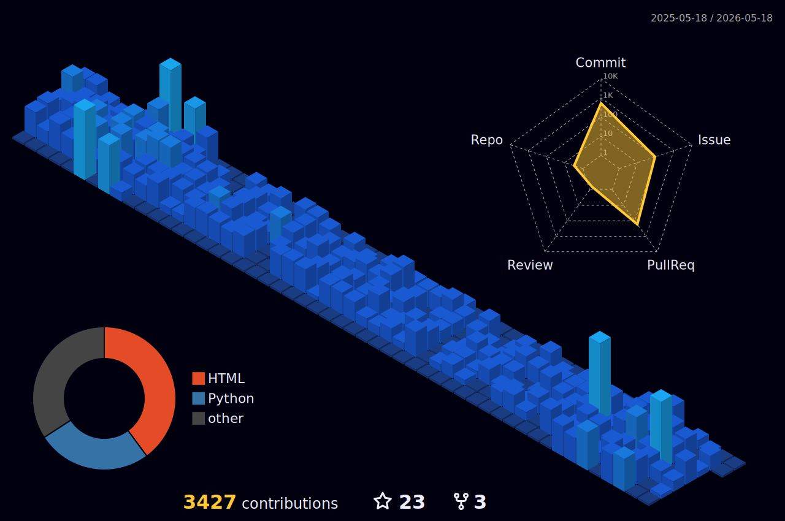

# 😺 About me

👉️[unsoluble_sugar: Multifaceted Tech Enthusiast](https://www.perplexity.ai/page/unsolublesugar-Multifaceted-Tech-_.lw0lfDQDW8ShJ4lwQs_A)

# 👨‍💻Skills

 
  
  
  
  
  
  

                             

<!--START_SECTION:lapras-card-->

  
Last Updated on 3/7/2026, 12:43:47 AM

<!--END_SECTION:lapras-card-->

[ACTIVITY LOG](https://github.com/unsolublesugar/lapras-output-summary)

# 📰 Featured posts

<!--[START POSTS]-->
- [uLoopMCP × Claude Code 〜 AI駆動でUnityゲーム開発してみた](https://www.docswell.com/s/unsoluble_sugar/KYVY7E-2026-02-20-182013)
- [Claude Code 超入門 バイブコーディングでつくる自分用ニュースまとめ](https://www.docswell.com/s/unsoluble_sugar/KWM7R1-2025-11-24-161918)
-  [【LT】ゆるいエンジニアリングコミュニティはいいぞ【事前収録動画＆書き起こし】](https://zenn.dev/easy_easy/articles/c50834cc069906)
-  [ゆるいエンジニアリングコミュニティ運営完全に理解した](https://zenn.dev/unsoluble_sugar/articles/3534caabc4f028)
-  [CourseraでGoogleのFoundations of Project Managementを履修した](https://zenn.dev/unsoluble_sugar/articles/5330b19412687ee0b435)
-  [Zenn完全に理解した](https://qiita.com/unsoluble_sugar/items/558a11b455d042d648d6)
-  [Godot Engineについて調べてみた](https://speakerdeck.com/unsoluble_sugar/godot-enginenituitediao-betemita)
-  [ドキュメント翻訳から始めるOSS推し活](https://speakerdeck.com/unsoluble_sugar/dokiyumentofan-yi-karashi-meruosstui-sihuo)
-  [VC ClientでRVC完全に理解した](https://speakerdeck.com/unsoluble_sugar/rvc-with-vcclient-completely-understood)
-  [「未経験からエンジニア」でやり抜いた時の昔話](https://note.com/unsoluble_sugar/n/ncc3b12a5859e)
-  [30代最後なので起業したエンジニアの戯言](https://note.com/unsoluble_sugar/n/n8a94ee0a78d4)
-  [とあるエンジニアのLT発表を支える技術](https://note.com/unsoluble_sugar/n/n079776e4c139)
<!--[END POSTS]-->

Read more on 
 [Zenn](https://zenn.dev/unsoluble_sugar) / 
 [Qiita](https://qiita.com/unsoluble_sugar) /
 [Speakerdeck](https://speakerdeck.com/unsoluble_sugar) /
 [note](https://note.com/unsoluble_sugar)

# 💻 Work Related posts
- [Datachainさん主催のエンジニアイベントにて司会・モデレーターを務めさせていただきます](https://note.com/unsoluble_sugar/n/n832c3442b0c8)
- [Developer eXperience Day 2024 生成AI関連講演のレポート記事を書かせていただきました](https://note.com/unsoluble_sugar/n/n4badf1881333)
- [分散型SNSの台頭。ポストTwitter（X）に求められるもの - paiza times](https://paiza.hatenablog.com/entry/2023/07/26/130000)
- [関連用語から深掘る ＜エンジニアのための「NFT完全に理解した」＞ - Tech Team Journal ](https://ttj.paiza.jp/archives/2023/06/30/8509/)
- [基礎から学ぶ、NFTとは？ ＜エンジニアのための「NFT完全に理解した」＞ - Tech Team Journal ](https://ttj.paiza.jp/archives/2023/06/13/7874/)
- [組織づくりを担うエンジニアリングマネージャーに話を聞いてみた　〜入社１年目エンジニアへのインタビュー〜](https://note.com/dev_onecareer/n/na99f2b723e2e)
- [強い組織をつくるためにエンジニア採用で実践していること](https://note.com/dev_onecareer/n/n8e6921164fa9)
- [「IT業界歴15年、7社でキャリアアップ！自分の強みを多角的に見せる」若手育成も担うエンジニアリングマネージャーのキャリアづくりとは【LAPRAS転職者インタビュー】 - LAPRAS NOTE ](https://note.lapras.com/method/sato/)
- [「リモートワークは心理的安全性と生産性のバランスが肝」GOTANDA VALLEY ENGINEER NIGHT #3レポート | 五反田計画](https://project.gotanda-valley.com/5v_engineer_night_3/)
- [エンジニアリングマネージャー目線で見るライブラリ技術選定の勘所 - Synamon’s Engineer blog](https://synamon.hatenablog.com/entry/technology-selection-for-library)
- [テックブログ運営を回すための取り組み 〜黄金の回転編〜 - Synamon’s Engineer blog](https://synamon.hatenablog.com/entry/involved-techblog)
- [情報発信が止まらない組織へ。エンジニアリングマネージャー・佐藤巧実の考える、これからのSynamon｜Synamon](https://note.com/synamon_xr/n/n44446570089a)
- [情報の架け橋になる ｜ ユカイ工学プロジェクトマネージャー 佐藤巧実 インタビュー｜ユカイ工学｜note ](https://note.com/ux_xu/n/n2d345843cefd)
- [グラムの開発にあるものと、チームで動くための心得｜グラム株式会社｜note](https://note.com/ginc/n/n2aa808ae8b85)
- [株式会社 マスカチ | Green](https://www.green-japan.com/pr/4238)
- [「スマホで2択」が女子高生の新たなブーム!? アンケートアプリ『aorb』が10代女子にウケる理由 - エンジニアtype | 転職type](https://type.jp/et/feature/5667/)
